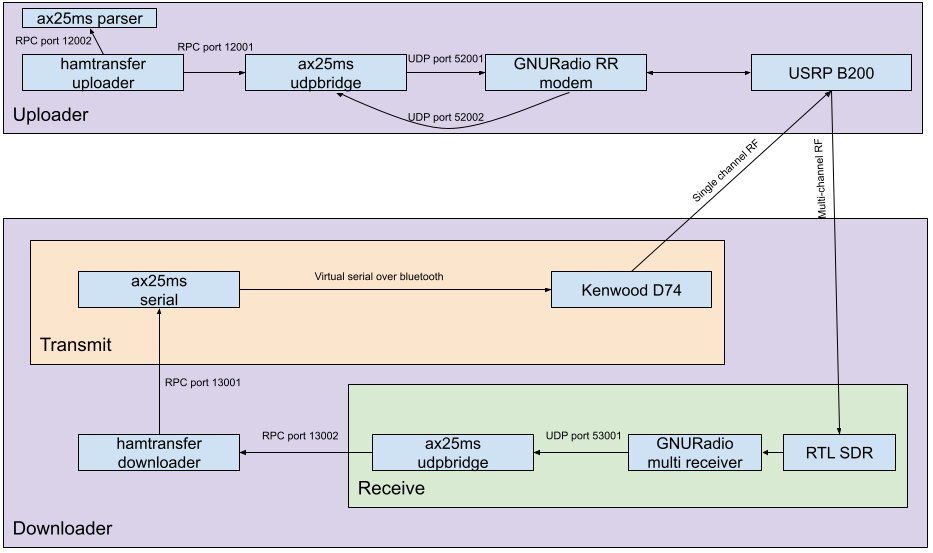
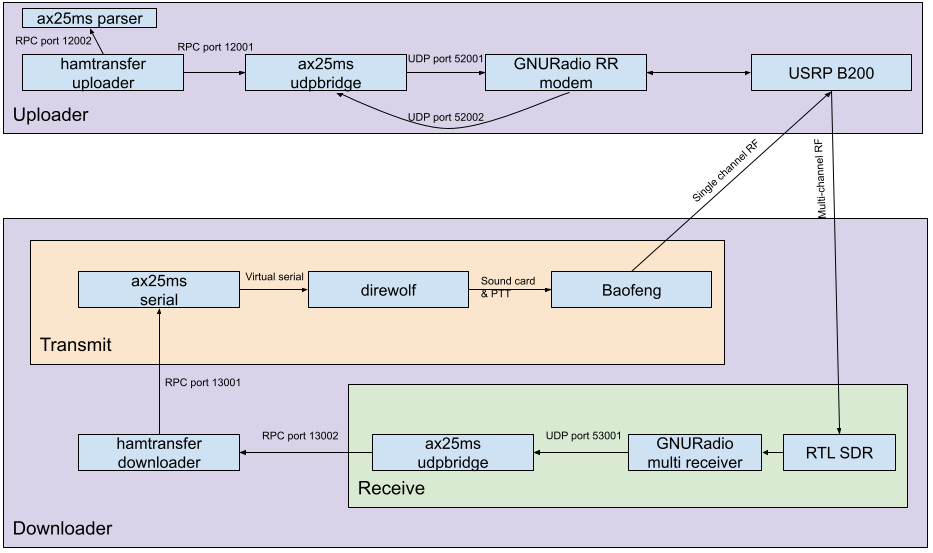

Or if the radio doesn't have a built in TNC:



Last tested with these git hashes:
* ax25ms-rust 59311862b34d7bf01df7706ac4f4eba8b7a92859
* hamtransfer 4d3ba2b58ea5097d1202d83ec3a284582c3f3a5f
* ax25ms 3d637afc2c2655f75a2c70fd25a2b334767574a8
* radiostuff e10b06665bf88b615d791e30191a048c31433526

## Results

With three channels:

10kB file in 7.518 seconds. That's including a needless roundtrip to
get metadata. Just the request/response was 6.356 seconds, or 12.6kbps.

## Uploader

### GNURadio RR modem

This starts the modem, which will listening on port 52001, and will
send packets received over radio to port 52002.

```
./modem_ax9600_rr.py
```

I set the `ogain` (output gain) to 0.9, and got good in-room
performance.

### ax25ms udpbridge

This is from the [ax25ms-rust][ax25ms-rust] package.

RPC-listen to 12001, send UDP packets to 52001, and receive them on
UDP port 52002.

```
udp-bridge -u 127.0.0.1:52001 -l '[::]:52002' -L '[::]:12001'
```

### ax25ms parser

If the downloader is running on the same machine, we could point the
parser (`-p`) to it, but if not then we need to start a router just
for its parsing RPC methods.

```
router_hub -l '[::]:12002'
```

### hamtransfer uploader

We point the parser to the downloaders `serial` on port 13001, but
another option is to run a separate `router_hub` for the parser functionality.

```
uploader \
    -i testdata/ \
	-p http://127.0.0.1:12002 \
	-r http://127.0.0.1:12001 \
	-S M0XXX-1 \
	--repeat=9
```

We unfortunately need to repeat the metadata packets a few times,
since the modem currently won't transmit until it has one packet for
every channel, and they pretty much must be the same size, too.

This is not a problem during data transmission, but it is when getting
metadata or listing files.

## Downloader

### Optional, if radio does not have a built in TNC

Direwolf config something like this:

```
ADEVICE plughw:1,0
PTT <your PTT config here>
CHANNEL 0
MYCALL M0XXX-2
AGWPORT 8010
KISSPORT 8011
MODEM 1200
```

```
direwolf -t 0 -p -c direwolf.conf
```

Try sending some packets with direwolf before trying to make this
HOWTO work. You need to have working PTT. VOX will not work with
Baofengs, in my experience. The beginning of the packet gets lost, and
it continues to transmit for way too long after input stops.

### GNURadio multi receiver

This listens to RF, and sends packets to UDP port 53001.

```
./modem_ax9600_multi_rx.py
```

### ax25ms udpbridge

```
udp-bridge -l '[::]:53001' -u 127.0.0.1:1 -L '[::]:13002'
```

### ax25ms serial

```
serial -l '[::]:13001' -p /dev/rfcomm0'
```

### hamtransfer downloader

```
downloader \
    -o test.out \
	-p http://127.0.0.1:13001 \
	-r http://127.0.0.1:13002 \
	-R http://127.0.0.1:13001 \
	-s M0XXX-2 \
	cc3ad95bbe0e01da598a23f81afbb085339b244131fbb5516d980ca9a0dd24d9
```

[ax25ms-rust]: https://github.com/ThomasHabets/ax25ms-rust
